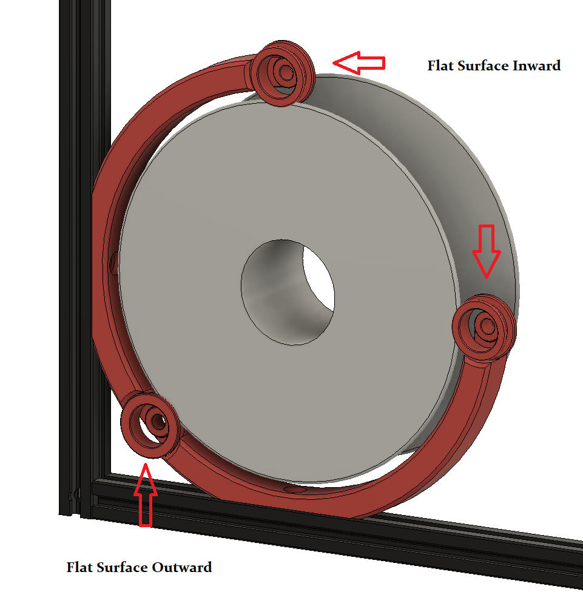

## Trident Internal Spool

### This is beta!  Only been tested on one machine (so far, mine) and with minimal print time. Please provide feedback for issues/suggestions to #Logan2225 on VoronDesign Discord.  Thanks! 

Update: Now uses 2 part bearing rings that clip together. Let me know if they work better/worse than the last ones if you've printed the single piece ones already. 
Also added an external mount for non-Trident printers in STL and hidden in the CAD files. 

This is a method to mount the filament spool inside the enclosure of a Voron Trident 3d printer. It works with 200mm, 1kg spools only. 

The ptfe tube is installed as shown: up through the gap in the side of the rear extrusion. Alternately you could drill a 4mm hole though the B stepper mount top and bottom parts. 

To install the spool: Feed the filament through the ptfe first, then align the spool into the front and top bearing rings, and pull forward to spring the frame and drop into the rear bearing ring. 

#### BOM:
- 3 608 bearings (any type)
- 2 M5-8mm pan head bolts
- 2 M5-Tnuts
- optional: 3 - M3-8mm bolts (any head type)

